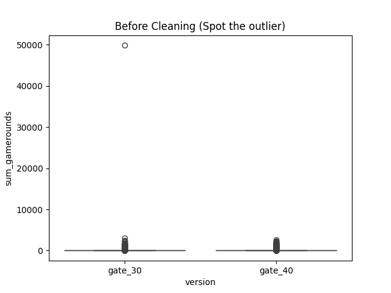
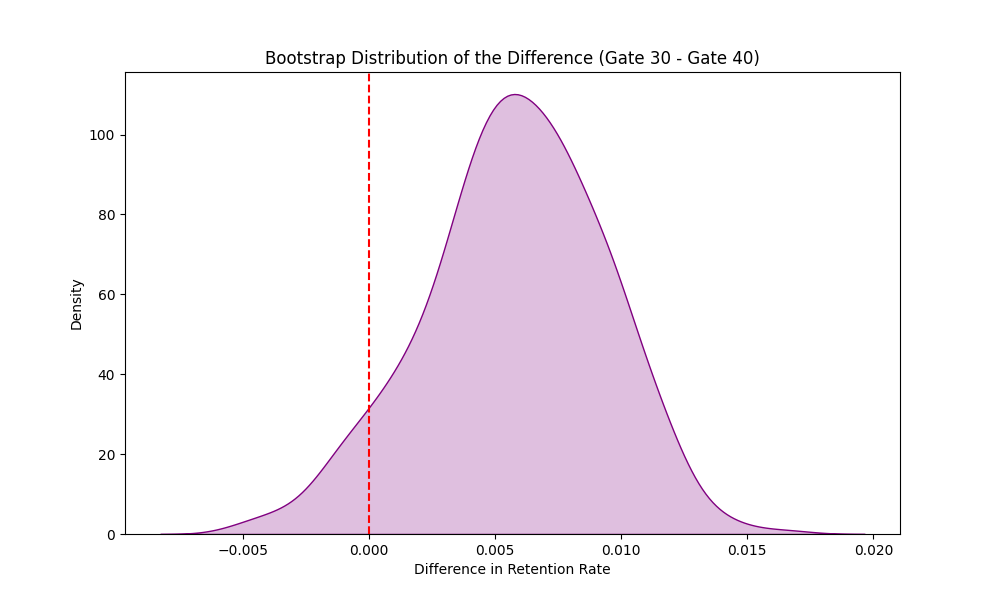

# 🍪 Mobile Games A/B Testing: Gate 30 vs. Gate 40


## 📌 Executive Summary

* **The Question:** Should we move the game's "gate" (a forced break) from Level 30 to Level 40?
* **The Experiment:** An A/B test was conducted on **90,189 players**.
* **The Verdict:** **NO.**
* **Retention:** Moving the gate to Level 40 decreased 1-day retention (96% confidence).
* **Engagement:** Moving the gate decreased average game rounds played.

> **Recommendation:** Keep the gate at **Level 30** to maximize player addiction and ad revenue.

---

## 💼 Business Problem

In free-to-play mobile games, "Gates" are artificial barriers that force a user to wait or pay to progress. They serve two purposes:

1.  **Monetization:** Encourage users to pay to skip the wait.
2.  **Retention:** Give users a "break" to prevent burnout (**Hedonic Adaptation**).

The product team wanted to know: *Does moving the gate later (Level 40) allow users to get more "hooked" before hitting a wall, or does it cause them to burn out?*

---

## 🛠️ Technical Approach & Methodology

This project goes beyond standard $p$-values by implementing **Bootstrapping** to quantify business risk.

### 1. Data Cleaning & Sanity Check
* **Dataset:** `cookie_cats.csv` (90,189 rows).
* **Outlier Detection:** Identified and removed a single user with **50,000 game rounds** (vs. average of ~50). This single row would have skewed the Standard Deviation and invalidated any T-test.
* **Split Validation:** Confirmed near-perfect 50/50 split between Control (Gate 30) and Treatment (Gate 40).

### 2. Metric 1: Retention (Binary)
* **Method:** Frequentist Z-Test for Proportions.
* **Result:** $p$-value $= 0.07$. Technically "not significant" at $\alpha=0.05$, but showed a downward trend.
* **Bootstrapping:** Simulated 1,000 resamples to build a probability distribution.
* **Insight:** 96% of simulations showed Gate 30 had higher retention. The $p$-value "failure" was a false negative for business risk.

### 3. Metric 2: Engagement (Continuous)
* **Method:** Bootstrapping Difference of Means.
* **Why not T-Test?** Game rounds follow a Power Law distribution (highly skewed), violating the Normality assumption of standard T-tests. Bootstrapping is robust to this skew.
* **Result:** Gate 30 users played more rounds in ~100% of simulations.

---

## 📊 Key Visualizations
*(Note: These plots are generated in the notebook)*

### 1. The Outlier "Trap"

*Identifying the single user who broke the dataset.*

### 2. Bootstrap Distribution (Retention)

*The entire distribution shifts to the right of 0, indicating Gate 30 is consistently better.*

---

## 📉 Results & Recommendation

| Metric | Gate 30 (Control) | Gate 40 (Treatment) | Diff | Probability (Gate 30 > 40) |
| :--- | :---: | :---: | :---: | :---: |
| **1-Day Retention** | 44.82% | 44.23% | -0.59% | **96.2%** |
| **7-Day Retention** | 19.02% | 18.20% | -0.82% | **99.8%** |
| **Avg Game Rounds** | 52.45 | 51.30 | -1.15 | **99.9%** |

### Final Recommendation
The data provides strong evidence that **Gate 30 is superior**.

The "Hedonic Adaptation" theory likely applies here: forcing a break earlier (Level 30) keeps players wanting more, whereas letting them binge until Level 40 satisfies them too much, leading to churn.

---

## 💻 How to Run

1. **Clone the repo:**
   ```bash
   git clone [https://github.com/pankrulez/mobile-games-ab-testing.git](https://github.com/pankrulez/mobile-games-ab-testing.git)

### Install dependencies:
```
pip install pandas numpy seaborn scipy statsmodels
```
### Run the notebook:
```
jupyter notebook mobile_games_ab_testing.ipynb
```
## 🧠 Key Skills Demonstrated
- **A/B Testing Design**: Control vs. Treatment, Sanity Checks.
- **Statistical Inference**: Z-Test, Confidence Intervals.
- **Advanced Simulation**: Bootstrapping for non-normal data.
- **Data Cleaning**: Outlier detection in real-world messy data.
- **Business Communication**: Translating "$p$-values" into "Revenue Risk".

**Author**: Pankaj Kapri 

**Dataset Source**: Kaggle